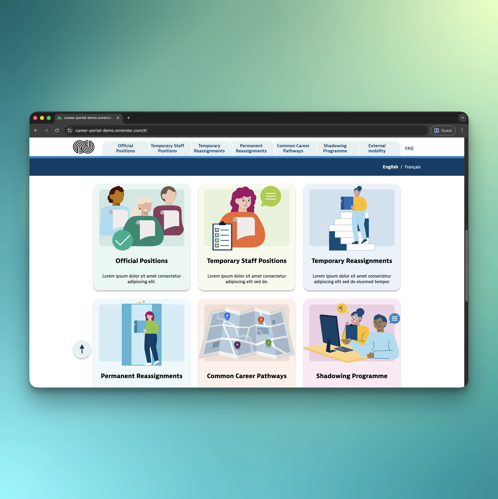
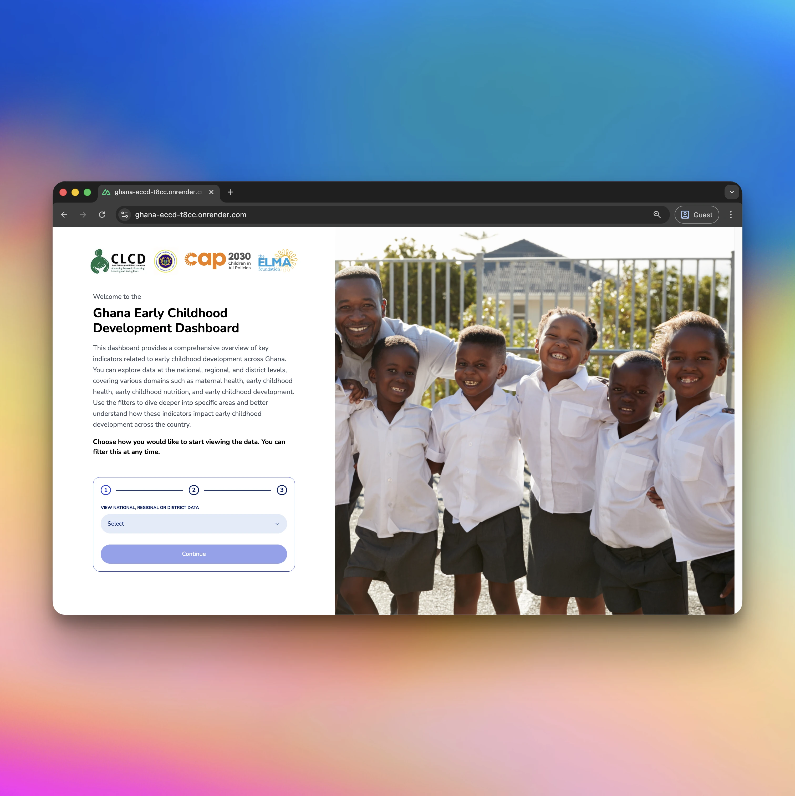
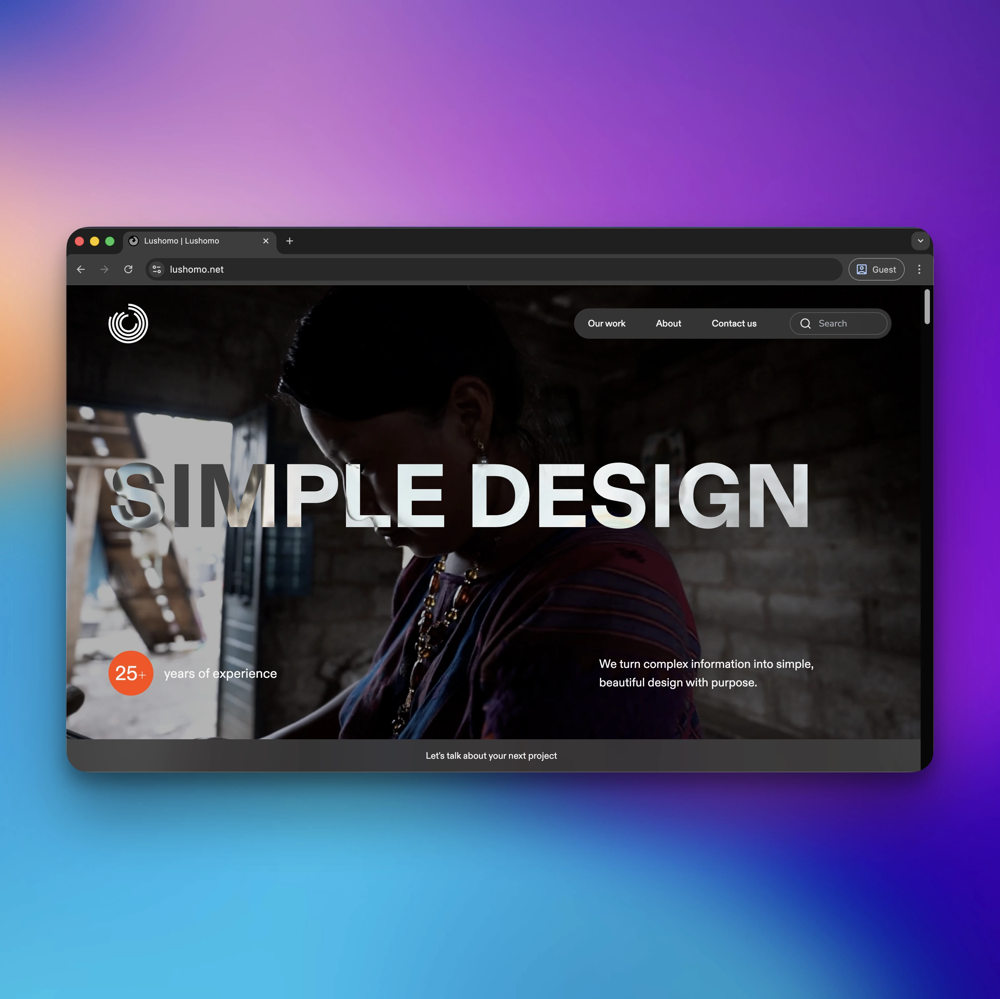
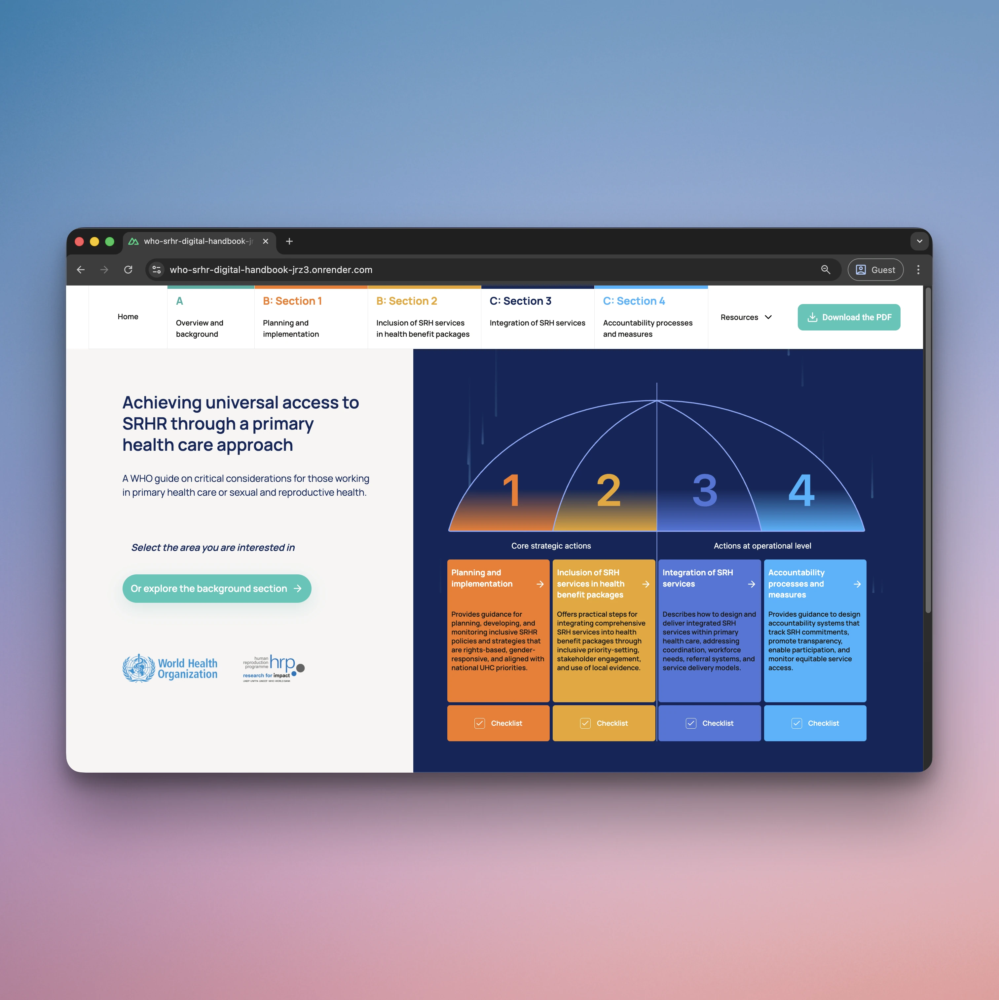
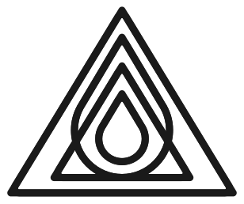

## 

### console.log("Hello world 👋");

- Automation and Robotics Engineer turned **Full Stack Web Engineer**. I bring a blend of systems thinking and creative obsession to building beautiful, performant interfaces.

- 8+ years crafting websites, dashboards, data visualizations, and apps that feel good to use.

- Founder of [Advaita Software](https://advaita.dev).

- (Occasionally) unreasonably invested in easing curves.

### Tech & Tools

  

### Featured Projects

  
  
  

  
  

### Connect with me

  <a href="mailto:lucas@advaita.dev" style="display: inline-flex; align-items: center; justify-content: center; padding: 10px 12px; height: 24px; background-color: #dc2626; color: white; text-decoration: none; border-radius: 8px; box-shadow: 0 4px 6px rgba(0, 0, 0, 0.1); margin: 5px; font-weight: 600;">
    
    Email
  </a>
  <a href="https://linkedin.com/in/lucbic/" style="display: inline-flex; align-items: center; justify-content: center; padding: 10px 12px; height: 24px; background-color: #0077B5; color: white; text-decoration: none; border-radius: 8px; box-shadow: 0 4px 6px rgba(0, 0, 0, 0.1); margin: 5px; font-weight: 600;">
    
    LinkedIn
  </a>
  <a href="https://www.upwork.com/freelancers/lucasbic" style="display: inline-flex; align-items: center; justify-content: center; padding: 10px 12px; height: 24px; background-color: #6fda44; color: white; text-decoration: none; border-radius: 8px; box-shadow: 0 4px 6px rgba(0, 0, 0, 0.1); margin: 5px; font-weight: 600;">
    
    Upwork
  </a>
  <a href="https://advaita.dev" style="display: inline-flex; align-items: center; justify-content: center; padding: 10px 12px; height: 24px; background-color: #f0e6d8; color: #1a1a1a; text-decoration: none; border-radius: 8px; box-shadow: 0 4px 6px rgba(0, 0, 0, 0.1); margin: 5px; font-weight: 600; overflow: hidden;">
    
    advaita.dev
  </a>

### GitHub Stats

  

